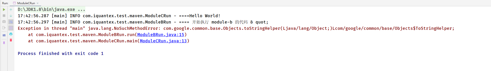

## maven-shade-plugin解决依赖冲突
该工程验证`maven-shade-plugin`通过重命名依赖的包名来解决依赖冲突问题。

使用该插件需要做什么：
- 导入插件依赖包
- 在build中使用插件，配置其信息

### 详情
通过不同版本的guava依赖（v19.0/v26.0-jre），这两个版本存在不同api。

模块b：使用旧版api。

模块c：使用新版api。

模块c引入模块b的实现，但由于模块c中新版api覆盖了模块b的旧api，使得模块b的逻辑无法正确执行。

### 结果
执行程序，由于依赖冲突导致异常： 

使用插件后，解决了该异常： 

> 注：此时不能使用 调试运行的方法 ，读者会发现使用 IDEA 等工具直接调试运行，仍旧会出错，这是因为 IDEA 调试运行只是经过了 compile 阶段，而 maven-shade-plugin 插件中的 shade relocation 根本没有执行。由于我们配置的 phase 是 package【绑定到 Maven 的 package 生命周期】，因此，必须经过打包后，直接指定 main 主类运行 jar 包，才会看到效果。
